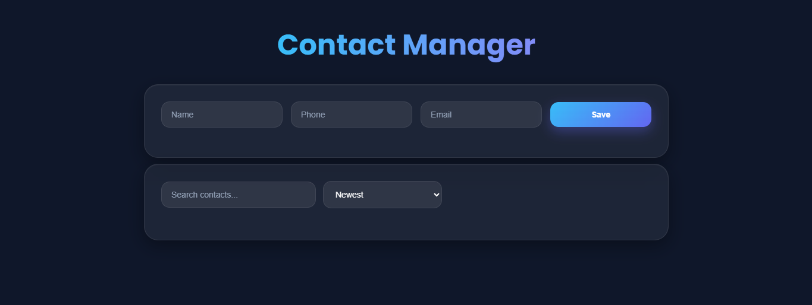
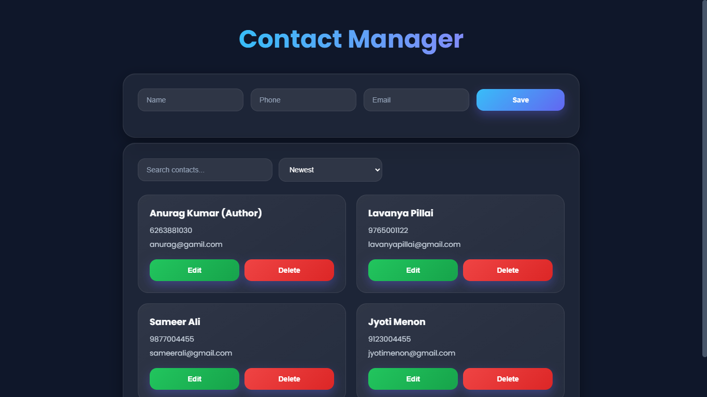

<div align="center">

# Contact Manager

### Modern Full-Stack Contact Management App


<br/>
<br/>

A sleek and responsive Contact Manager application built with a modern dark UI and MVC architecture.

</div>

---

# Features

## 1. Contact Management
- Add Contacts
- View Contacts
- Edit Contacts
- Delete Contacts

---

## 2. Smart Search
Search contacts instantly using:
- Name
- Email
- Phone Number

---

## 3. Sorting System
Organize contacts by:
- Newest First
- Oldest First

---

## 4. Modern UI
- Dark Theme
- Glow Effects
- Smooth Animations
- Responsive Design
- Custom Dropdown Styling
- Hover Effects

---

## 5. MVC Architecture
Clean backend separation using:
- Models
- Controllers
- Routes
- Config

---

# Screenshots

<div align="left">

## Main Dashboard



<br/>

## With Contacts



</div>

---

# Project Structure

```bash
CONTACT MANAGER
│
├── assets
├── client
└── server
```

### Frontend
```bash
client/
├── data.json
├── index.html
├── script.js
└── style.css
```

### Backend
```bash
server/
├── config/
│   └── db.js
│
├── Controllers/
│   └── contactController.js
│
├── models/
│   └── Contact.js
│
├── Routes/
│   └── contactRoutes.js
│
├── node_modules/
│
├── model.js
├── package.json
├── package-lock.json
└── server.js
```

---

# Tech Stack

<div align="center">

| Frontend | Backend | Database |
|---------|----------|-----------|
| HTML5 | Node.js | MongoDB |
| CSS3 | Express.js | Mongoose |
| JavaScript | REST API | BSON |

</div>

---

# Getting Started

## 1️. Clone Repository

```bash
git clone https://github.com/your-username/contact-manager.git
```

## 2️. Navigate to Server

```bash
cd server
```

## 3️. Install Dependencies

```bash
npm install
```

# 4️. Start MongoDB

Ensure MongoDB is running locally:

```bash
mongodb://127.0.0.1:27017/contactDB
```

---

# 5️. Run Server

```bash
node server.js
```

---

# API Endpoints

<div align="center">

| Method | Endpoint | Description |
|-------|-----------|-------------|
| POST | `/contacts` | Create Contact |
| GET | `/contacts` | Fetch Contacts |
| PUT | `/contacts/:id` | Update Contact |
| DELETE | `/contacts/:id` | Delete Contact |

</div>

---

# Example API Usage

## Create Contact

```http
POST /contacts
```

```json
{
  "name": "Rahul Sharma",
  "phone": "9876543210",
  "email": "rahulsharma@gmail.com"
}
```

---

## Search & Sort

```http
GET /contacts?search=rahul&sort=asc
```

---

# MongoDB Schema

```json
{
  "name": "Ayush Roy",
  "phone": "9874565123",
  "email": "ayushroy@gmail.com",
  "createdAt": "2026-05-05T12:29:56.631Z"
}
```

---

# UI Highlights

## Dark Theme
Modern glassmorphism-inspired dark interface.

## Animations
- Hover transitions
- Smooth card movement
- Button glow effects

## Responsive
Works across:
- Desktop
- Mobile
- Tablet

---

# Concepts Practiced

- REST APIs
- MVC Architecture
- MongoDB CRUD
- Express Routing
- Async/Await
- Fetch API
- Responsive Design
- DOM Manipulation

---

# Future Improvements

- JWT Authentication
- MongoDB Atlas
- Deployment
- Toast Notifications
- Pagination
- Validation Middleware
- Dashboard Analytics

---

# Developer


  
## Built by Anurag Kumar


<a href="https://github.com/Anurag-3112" target="_blank">
  
</a>

<a href="https://linkedin.com/in/anurag-kumar-work" target="_blank">
  
</a>


---

## 🌟 Support The Project

If you found this project helpful:

⭐ Star the repository  
🍴 Fork the project  
🛠️ Contribute improvements  
📢 Share with others
